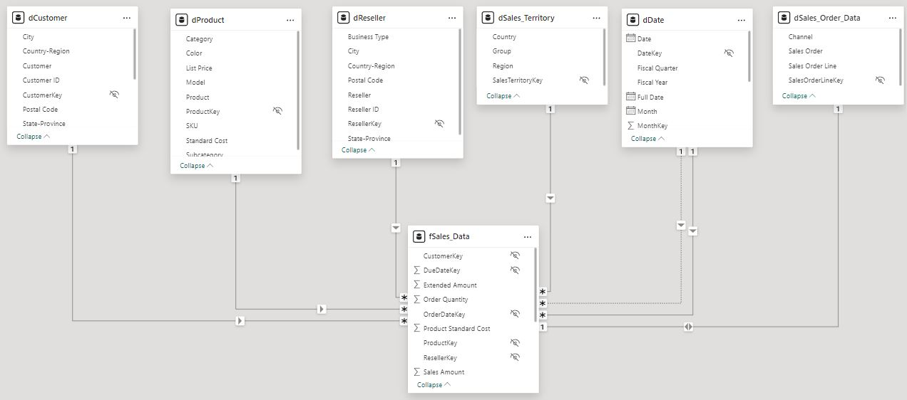

# AdventureWorks-sales-dashboard
The Business Intelligence with Power BI End-to-End Solutions 4-hour training.

## Loading of Dataset:
You can refer to this 
The data set used in this project was taken from the following [link](https://github.com/microsoft/powerbi-desktop-samples/blob/main/AdventureWorks%20Sales%20Sample/AdventureWorks%20Sales.xlsx). It is a csv file containing seven tables. Each table was loaded into a Power Query.

# Dashboard Creation:

### Here are my key takeaways and realizations:
1. Data is important in various context, including business, science, technology, and everyday decision-making.
2. Having the right skills to analyze and understand the data will allow you to uncover valuable insights and opportunities for innovation.
3. Data analysts have a vita role to any businesses, with their problem-solving skills and proficiency in generating data-driven insights. Their role empowers business with informed decision-making which is essential for sustainable growth and success.

Special thanks to Sir Abs Avilla and the DataSense Analytics Team for providing me with this excellent opportunity to learn how to create a Sales Dashboard by using Power BI Desktop.
